<div align="center">
	<h1> ESEJKC </h1>
	<h3>Embedded Software Engineer Job Knowledge Checklist</h3>
	<h3>嵌入式软件工程师求职知识清单</h3>
</div>
## C / C++

### 指针

#### 1. 指针的基本概念

**指针的作用**：可以通过指针间接访问内存

- 内存编号是从 0 开始记录的，一般用十六进制数字表示
- 可以利用指针变量保存地址

<u>指针也是一种数据类型，该数据类型所占内存为多少？</u>

在 32 位操作系统下，占 4 个字节（byte）空间，在 64 位操作系统下，占 8 个字节（byte）空间。


#### 2. 空指针与野指针

**空指针**：指针变量指向内存中编号为 0 的空间，用于<u>初始化指针变量</u>

> [!caution]
>
> 空指针指向的内存是不可以访问的

```cpp
int *p = NULL;
*p = 100;  // ERROR
```

> [!note]
>
> `0~255` 之间的内存编号为系统占用，用户不可访问

**野指针**：指针变量指向非法的内存空间

```cpp
int *p = (int *)0x1100; // ERROR
```

> [!tip]
>
> 空指针与野指针都不是我们自己申请的空间，因此不要随意访问。


#### 3. const 修饰指针

`const` 修饰指针有三种情况：

1. `const` 修饰指针：常量指针
2. `const` 修饰常量：指针常量
3. `const` 即修饰指针，又修饰常量

##### 3.1 常量指针

指针指向的<mark>地址可以更改</mark>，但指针指向<mark>地址中存放的值不可更改</mark>

```cpp
const int * p = &addr1;
p = &addr2; 
*p = 100; // ERROR
```

##### 3.2 指针常量

指针指向的<mark>地址不可以更改</mark>，但指针指向<mark>地址中的存放的值可以更改</mark>

```cpp
int * const p = &addr1;
p = &addr2; // ERROR
*p = 100;
```

##### 3.3 即修饰指针，又修饰常量

指针指向的地址和指针指向地址中存放的值<mark>都不可以更改</mark>

```cpp
const int * const p = &addr1;
p = &addr2; // ERROR
*p = 100;   // ERROR
```

#### 4. 结构体指针

通过指针访问结构体中的成员，利用操作符 `->` 可以通过结构体指针访问结构体属性。


### 内存分区模型

C/C++ 程序在执行时，将内存大方向分为 **4 个区域**：

- **代码区**：存放函数体的二进制代码，由操作系统进行管理
- **全局区**：存放<u>全局变量</u>和<u>静态变量</u>以及<u>常量</u>
- **栈区**：由<u><mark>编译器</mark>自动分配释放</u>，存放<u>函数的参数值</u>，<u>局部变量</u>等
- **堆区**：由<u><mark>程序员</mark>分配和释放</u>，若程序员不释放，程序结束时由操作系统回收

内存分区的意义？

不同区域存放的数据，拥有不同的生命周期，以实现更大程度上的灵活编程

#### 1. 程序运行前

在程序编译后，生成了 `exe` 可执行程序，未执行该程序前分为两个区域：

**代码区**：

- 存放 CPU 的机器指令
- 代码区是**共享的**，共享的目的是对于频繁被执行的程序，只需要在内存中有一份代码即可
- 代码区是**只读的**，原因是防止程序意外修改它的指令

**全局区**：

- <u>全局变量</u>，<u>静态变量</u>存放在此
- 全局区还包含了常量区，<u>字符串常量</u>和<u>其他常量</u>也存放在此
- 该区域的数据在<u>程序结束后由操作系统释放</u>


#### 2. 程序运行后

**栈区**：

由编译器自动分配释放，存放<u>函数的参数值</u>，<u>局部变量</u>等

> [!caution]
>
> 不要返回局部变量的地址，栈区开辟的数据由编译器自动释放

**堆区**： 

- 由程序员分配释放，若程序员不释放，程序结束时由操作系统回收

- C 中主要利用 `malloc()` 在堆区<u>开辟内存</u>，用 `free()` <u>释放内存</u>

    ```c
    #include <stdio.h>
    #include <stdlib.h>
    
    /* 在堆区开辟变量 */
    int *func1() 
    {
        int *p = (int *)malloc(sizeof(int));
        *p = 10;
        return p;
    }
    
    /* 在堆区开辟数组 */
    int *func2()
    {
        int *arr = (int *)malloc(sizeof(int) * 10);
        return arr;
    }
    
    int main()
    {
        int *p = func1();
        int *arr = func2();
    
        printf("%d\n", *p);
        for (int i = 0; i < 10; i++) {
            arr[i] = i;
            printf("%d\n", arr[i]);
        }
    
        free(p);
        free(arr);
        return 0;
    }
    ```

- C++ 中主要利用 `new` 在堆区<u>开辟内存</u>，用 `delete` <u>释放内存</u>

    ```cpp
    #include <iostream>
    using namespace std;
    
    /* 在堆区开辟变量 */
    int *func1()
    {
        int * p = new int(10);
        return p;
    }
    
    /* 在堆区开辟数组 */
    int *func2()
    {
        int *arr = new int[10];
        return arr;
    }
    
    int main()
    {
        int *p = func1();
        int *arr = func2();
        
        cout << *p << endl;
        for (int i = 0; i < 10; i++) {
            arr[i] = i;
            cout << arr[i] << endl;
        }
        
        delete p;
        /* 释放数组时要加一个 [] */
        delete[] arr; 
        return 0;
    }
    ```

    > [!important]
    >
    > C++ 中使用 `delete` 释放数组时必须加上 `[]` 符号，若不加 `[]` 则仅释放一个元素。


### 引用

#### 1. 引用的基本使用

**作用**：给变量起别名

**语法**：数据类型 &别名 = 原名

```cpp
int a = 10;
int &b = a;
```

> [!note]
>
> 引用操作后 `a`，`b` 均指向同一地址。


#### 2. 引用的注意事项

- 引用<u>必须要初始化</u>

    ```cpp
    sint &b; // ERROR:必须指定是谁的别名
    ```

- 引用在初始化后，<u>不可以改变为其他变量的引用</u>


#### 3. 引用做函数参数

**作用**：函数传参时，可以利用引用的技术让形参修饰实参

**优点**：可以简化指针修改实参

```cpp
/* 交换数值 - 指针传参 */
void swap1(int *a, int *b)
{
    int temp = *a;
    *a = *b;
    *b = temp;
}

/* 交换数值 - 引用传参 */
void swap2(int &a, int &b)
{
    int temp = a; 
    a = b;
    b = temp;
}

int main()
{
    int a = 1;
    int b = 2;
 
    swap1(&a, &b);
    cout << "a = " << a << " b = "  << b << endl;
    swap2(a, b);
    cout << "a = " << a << " b = "  << b << endl;
    
    return 0;
}
```

## 数据结构与算法

### 数组

### 链表

### 哈希表

### 字符串

### 栈与队列

### 二叉树

### 排序算法

### 滤波算法

## Linux

### 命令行

### 子系统

### 进程

### 信号

### 管道

### 消息队列

### system-V IPC 信号量

### 共享内存

### 线程

### POSIX 信号量

### POSIX 互斥锁

## RTOS

### 任务管理

### 消息队列

### 信号量

### 互斥量

### 事件

### 软件定时器

### 任务通知

### 内存管理

### 中断管理

## 模拟电路

### 电阻

### 电容

### 电感

### 二极管

### 三极管

#### 1. 三极管基本特性

### MOS管（场效应管）

#### 1. MOS管基本特性

### AD / DA

### 运算放大器

### 加减法电路

### 滤波器电路

### 功放电路

### 电源

### 经验向

多少线宽能通多少电流？

什么信号用差分走线？

差分走线的优缺点


差分走线，PCIE走线分别要用多少欧的阻抗

布局的走线间距是多少？

## 数字电路

### 基础门运算

### 触发器

### 寄存器

### 全加器

### 半加器

### 时序电路

### 组合电路

## 通信协议

### SPI

> 内容截取自：[野火]《Linux基础与应用开发实战指南—基于LubanCat-RK系列板卡》

SPI 协议是由摩托罗拉公司提出的通讯协议 ( Serial Peripheral Interface )，即串行外围设备接口，是一种高速全双工的通信总线。它被广泛地使用在 ADC、LCD 等设备与 MCU 间，要求通讯速率较高的场合。

#### 1. SPI 物理层

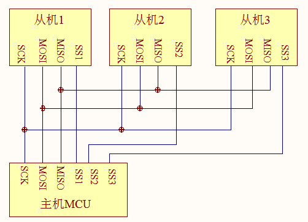

SPI 通讯使用 3 条总线及片选线，3 条总线分别为 SCK、MOSI、MISO，片选线为，它们的作用介绍如下：

- **( Slave Select )** ：从设备选择信号线，常称为片选信号线，也称为 NSS、CS，以下用 NSS 表示。当有多个 SPI 从设备与 SPI 主机相连时，设备的其它信号线 SCK、MOSI 及 MISO 同时并联到相同的 SPI 总线上，即无论有多少个从设备，都共同只使用这3 条总线；而每个从设备都有独立的这一条 NSS 信号线，本信号线独占主机的一个引脚，即有多少个从设备，就有多少条片选信号线。I2C 协议中通过设备地址来寻址、选中总线上的某个设备并与其进行通讯；而 SPI 协议中没有设备地址，它**使用 NSS 信号线来寻址**，当主机要选择从设备时，把该从设备的NSS 信号线设置为低电平，该从设备即被选中，即片选有效，接着主机开始与被选中的从设备进行 SPI 通讯。所以 SPI 通讯**以 NSS 线置低电平为开始信号，以 NSS 线被拉高作为结束信号。**
- **SCK (Serial Clock)** ：时钟信号线，用于通讯数据同步。它由通讯主机产生，决定了通讯的速率，不同的设备支持的最高时钟频率不一样，如 RT1052 的SPI 时钟频率最大为 $f_{pclk}/2$，两个设备之间通讯时，通讯速率受限于低速设备。
- **MOSI (Master Output，Slave Input)** ：主设备输出/从设备输入引脚。主机的数据从这条信号线输出，从机由这条信号线读入主机发送的数据，即这条线上数据的方向为**主机到从机**。
- **MISO(Master Input,，Slave Output)** ：主设备输入/从设备输出引脚。主机从这条信号线读入数据，从机的数据由这条信号线输出到主机，即在这条线上数据的方向为**从机到主机**。

#### 2. SPI 协议层

与 I2C 的类似，SPI 协议定义了通讯的起始和停止信号、数据有效性、时钟同步等环节。

##### 2.1 SPI 基本通讯过程

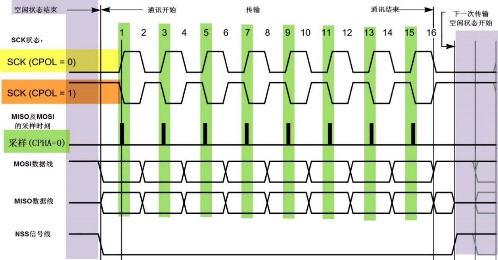

这是一个主机的通讯时序。NSS、SCK、MOSI 信号都由主机控制产生，而 MISO 的信号由从机产生，主机通过该信号线读取从机的数据。MOSI 与 MISO 的信号只在 NSS 为低电平的时候才有效，在 SCK 的每个时钟周期 MOSI 和 MISO 传输一位数据。

##### 2.2 通讯的起始和停止信号

在上图中的标号处，NSS 信号线由高变低，是 SPI 通讯的起始信号。NSS 是每个从机各自独占的信号线，当从机检在自己的 NSS 线检测到起始信号后，就知道自己被主机选中了，开始准备与主机通讯。在图中的标号处，NSS 信号由低变高，是 SPI 通讯的停止信号，表示本次通讯结束，从机的选中状态被取消。

##### 2.3 数据有效性

SPI 使用 MOSI 及 MISO 信号线来传输数据，使用 SCK 信号线进行数据同步。MOSI 及 MISO 数据线在 SCK 的每个时钟周期传输一位数据，且数据输入输出是同时进行的。数据传输时，MSB 先行或 LSB 先行并没有作硬性规定，但要保证两个 SPI 通讯设备之间使用同样的协定，一般都会采用上图中的 MSB 先行模式。

观察图中的标号处，MOSI 及 MISO 的数据在 SCK 的上升沿期间变化输出，在SCK 的下降沿时被采样。即在 SCK 的下降沿时刻，MOSI 及 MISO 的数据有效，高电平时表示数据 “1”，为低电平时表示数据 “0”。在其它时刻，数据无效，MOSI 及 MISO 为下一次表示数据做准备。SPI 每次数据传输可以 8 位或 16 位为单位，每次传输的单位数不受限制。

##### 2.4 CPOL/CPHA 及通讯模式

上面讲述的图中的时序只是 SPI 中的其中一种通讯模式，SPI 一共有四种通讯模式，它们的主要区别是总线空闲时 SCK 的时钟状态以及数据采样时刻。为方便说明，在此引入 “ 时钟极性 CPOL ” 和 “ 时钟相位 CPHA ” 的概念。

- 时钟极性 CPOL 是指 SPI 通讯设备处于空闲状态时，SCK 信号线的电平信号 ( 即 SPI 通讯开始前、NSS 线为高电平时 SCK 的状态)。CPOL=0 时，SCK 在空闲状态时为低电平，CPOL=1 时，则相反。
- 时钟相位 CPHA 是指数据的采样的时刻，当 CPHA=0 时，MOSI 或 MISO 数据线上的信号将会在 SCK 时钟线的 “ **奇数边沿** ” 被采样。当 CPHA=1 时，数据线在 SCK 的 “ **偶数边沿** ” 采样。

如下图：


我们来分析这个 CPHA=0 的时序图。首先，根据 SCK 在空闲状态时的电平，分为两种情况。SCK 信号线在空闲状态为低电平时，CPOL=0；空闲状态为高电平时，CPOL=1。

无论 CPOL=0 还是 =1，因为我们配置的时钟相位 CPHA=0，在图中可以看到，采样时刻都是在 SCK 的奇数边沿。注意当 CPOL=0 的时候，时钟的奇数边沿是上升沿，而 CPOL=1 的时候，时钟的奇数边沿是下降沿。所以 SPI 的采样时刻不是由上升/下降沿决定的。MOSI 和 MISO 数据线的有效信号在 SCK 的奇数边沿保持不变，数据信号将在 SCK 奇数边沿时被采样，在非采样时刻，MOSI 和MISO 的有效信号才发生切换。

类似地，当 CPHA=1 时，不受 CPOL 的影响，数据信号在 SCK 的偶数边沿被采样。

如下图：

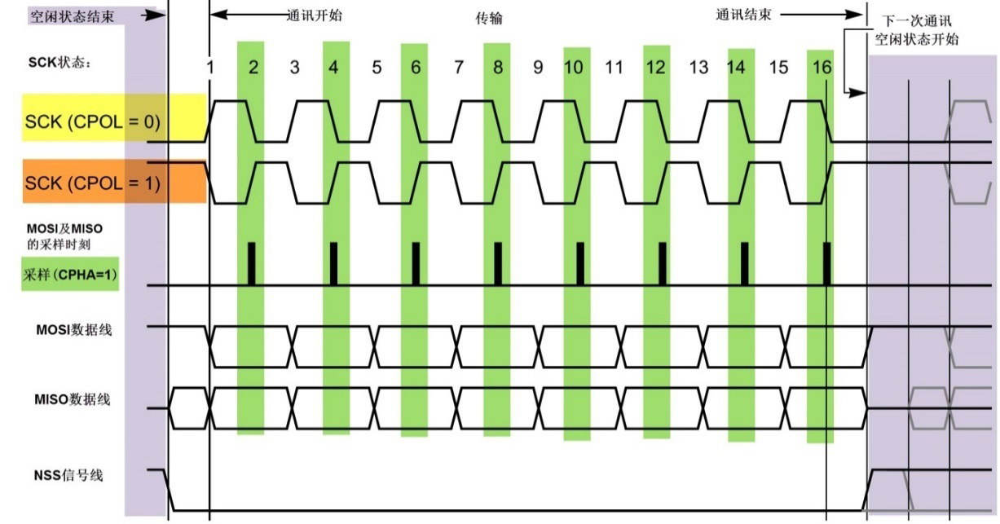

由 CPOL 及 CPHA 的不同状态，SPI 分成了四种模式，见下表，主机与从机需要工作在相同的模式下才可以正常通讯，实际中采用较多的是 “ 模式 0 ” 与 “ 模式 3 ”。

| SPI 模式 | CPOL | CPHA | 空闲时 SCK 时钟 | 采样时刻 |
| :------: | :--: | :--: | :-------------: | :------: |
|    0     |  0   |  0   |     低电平      | 奇数边沿 |
|    1     |  0   |  1   |     低电平      | 偶数边沿 |
|    2     |  1   |  0   |     高电平      | 奇数边沿 |
|    3     |  1   |  1   |     高电平      | 偶数边沿 |

#### 3. 扩展SPI 协议

以上介绍的是经典 SPI 协议的内容，这种也被称为标准 SPI 协议（ Standard SPI ）或单线SPI 协议（ Single SPI ），其中的单线是指该 SPI 协议中使用单根数据线 MOSI 进行发送数据，单根数据线 MISO 进行接收数据。

为了适应更高速率的通讯需求，半导体厂商扩展 SPI 协议，主要发展出了Dual/Quad/Octal SPI 协议，加上标准 SPI 协议（ Single SPI ），这四种协议的**主要区别是数据线的数量及通讯方式**，具体见下表。

|         协议          |  数据线数量及功能   | 通讯方式 |
| :-------------------: | :-----------------: | :------: |
| Single SPI（标准SPI） | 1 根发送，1 根接收  |  全双工  |
|  Dual SPI（双线SPI）  | 收发共用 2 根数据线 |  半双工  |
|  Quad SPI（四线SPI）  | 收发共用 4 根数据线 |  半双工  |
| Octal SPI（八线SPI）  | 收发共用 8 根数据线 |  半双工  |

扩展的三种 SPI 协议都是半双工的通讯方式，也就是说它们的数据线是分时进行收发数据的。例如，标准 SPI（Single SPI）与双线 SPI（Dual SPI）都是两根数据线，但标准 SPI（Single SPI）的其中一根数据线只用来发送，另一根数据线只用来接收，即全双工；而双线 SPI（Dual SPI）的两根线都具有收发功能，但在同一时刻只能是发送或者是接收，即半双工，四线 SPI（Quad SPI）和八线 SPI（Octal SPI）与双线 SPI（Dual SPI）类似，只是数据线量的区别。

##### 3.1 SDR 和 DDR 模式

扩展的 SPI 协议还增加了 SDR 模式（ 单倍速率Single Data Rate ）和 DDR 模式（ 双倍速率DoubleData Rate）。例如在标准 SPI 协议的 SDR 模式下，只在 SCK 的单边沿进行数据传输，即一个 SCK时钟只传输一位数据；而在它的 DDR 模式下，会在 SCK 的上升沿和下降沿都进行数据传输，即一个 SCK 时钟能传输两位数据，传输速率提高一倍。

### I2C

> 内容截取自：[野火]《Linux基础与应用开发实战指南—基于LubanCat-RK系列板卡》

I2C 通讯协议 ( Inter － Integrated Circuit ) 是由 Phiilps 公司开发的，由于它==引脚少，硬件实现简单，可扩展性强，不需要 USART、CAN 等通讯协议的外部收发设备==，被广泛地使用在多个集成电路 ( IC ) 间的通讯。

#### 1. I2C 物理层

I2C 通讯设备之间的常用连接方式如下图：

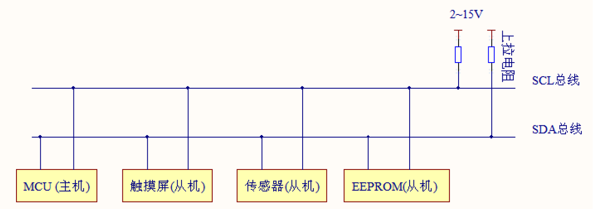

它的物理层有如下特点：

- 它是一个支持多设备的总线。“ 总线 ” 指多个设备共用的信号线。在一个 I2C 通讯总线中，可连接多个 I2C 通讯设备，**支持多个通讯主机及多个通讯从机**。
- 一个 I2C 总线只使用两条总线线路，一条双向串行数据线 ( SDA ) ，一条串行时钟线( SCL )。数据线即用来表示数据，时钟线用于数据收发同步。
- 每个连接到总线的设备都有一个独立的设备地址，主机可以利用这个地址进行不同设备之间的访问。其中地址是一个七位或十位的数字。
- 总线通过上拉电阻接到电源。**当 I2C 设备空闲时，会输出高阻态**，而当所有设备都空闲，都输出高阻态时，由上拉电阻把总线拉成高电平。
- 多个主机同时使用总线时，为了防止数据冲突，会利**用仲裁方式决定由哪个设备占用总线**。
- 具有三种传输模式：标准模式传输速率为100kbit/s ，快速模式为400kbit/s ，高速模式下可达3.4Mbit/s，但目前大多I2C 设备尚不支持高速模式。
- 连接到相同总线的 IC 数量受到总线的最大电容 400pF 限制。

#### 2. I2C 协议层

I2C 的协议定义了通讯的起始和停止信号、数据有效性、响应、仲裁、时钟同步和地址广播等环节。

##### 2.1 I2C 基本读写过程

I2C 通讯过程的基本结构，它的通讯过程常有如下三种方式：

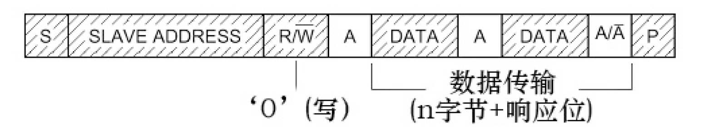

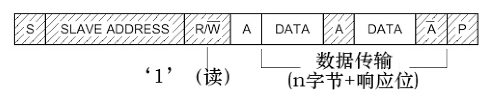

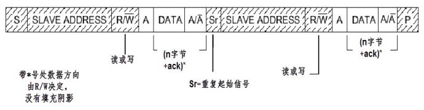

图例：

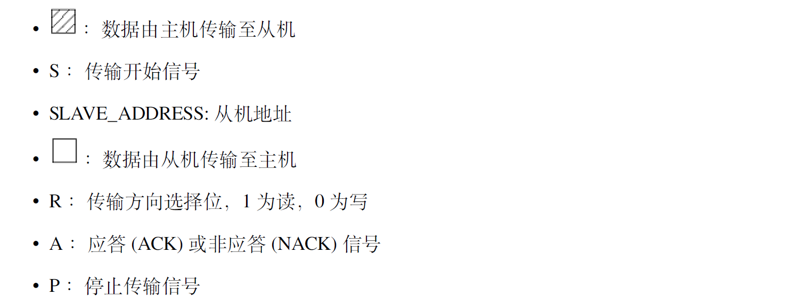

这些图表示的是主机和从机通讯时，SDA 线的数据包序列。

1. 其中S 表示由主机的 I2C 接口产生的传输起始信号 ( S )，这时连接到 I2C 总线上的所有从机都会接收到这个信号。
2. 起始信号产生后， 所有从机就开始等待主机紧接下来广播的从机地址信号
    ( SLAVE_ADDRESS )。在 I2C 总线上，每个设备的地址都是唯一的，当主机广播的地址与某个设备地址相同时，这个设备就被选中了，没被选中的设备将会忽略之后的数据信号。根据 I2C 协议，这个从机地址可以是 7 位或 10 位。
3. 在地址位之后，是传输方向的选择位，该位为 0，表示后面的数据传输方向是由主机传输至从机，即主机向从机写数据。该位为 1，则相反，即主机由从机读数据。
4. 从机接收到匹配的地址后，主机或从机会返回一个应答 ( ACK ) 或非应答 ( NACK ) 信号，只有接收到应答信号后，主机才能继续发送或接收数据。

写数据方向：

若配置的方向传输位为 “ 写数据 ” 方向，即第一幅图的情况，广播完地址，接收到应答信号后，主机开始正式向从机传输数据 ( DATA ) ，==数据包的大小为 8 位，主机每发送完一个字节数据，都要等待从机的应答信号 ( ACK )，重复这个过程，可以向从机传输 N 个数据，这个 N 没有大小限制==。当数据传输结束时，主机向从机发送一个停止传输信号( P )，表示不再传输数据。

读数据方向：

若配置的方向传输位为 “ 读数据 ” 方向，即第二幅图的情况，广播完地址，接收到应答信号后，从机开始向主机返回数据 ( DATA ) ，数据包大小也为 8 位，从机每发送完一个数据，都会等待主机的应答信号 ( ACK )，重复这个过程，可以返回 N 个数据，这个 N 也没有大小限制。==当主机希望停止接收数据时，就向从机返回一个非应答信号(NACK)，则从机自动停止数据传输。==

复合格式：

除了基本的读写，I2C 通讯更常用的是复合格式，即第三幅图的情况，该传输过程有==两次起始信号 ( S )== 。一般在第一次传输中，主机通过 SLAVE_ADDRESS 寻找到从设备后，发送一段 “ 数据 ”，这段数据通常用于表示从设备内部的寄存器或存储器地址 ( 注意区分它与 SLAVE_ADDRESS 的区别 )；在第二次的传输中，对该地址的内容进行读或写。也就是说，==第一次通讯是告诉从机读写地址，第二次则是读写的实际内容。==

以上通讯流程中包含的起始、停止、数据有效性、地址和数据方向以及响应的说明按小节如下。

##### 2.2 通讯的起始和停止信号

前文中提到的起始 ( S ) 和停止 ( P ) 信号是两种特殊的状态，起始和停止信号一般由主机产生。如下图：

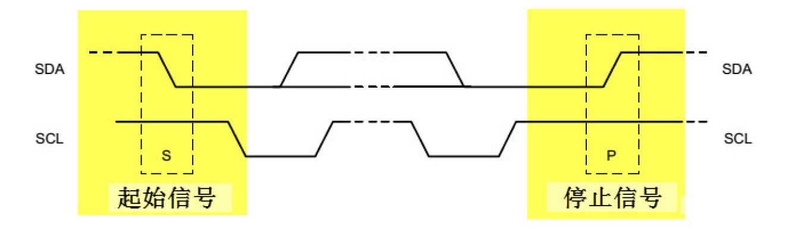

- 当 **SCL 线是高电平**时 **SDA 线从高电平向低电平切换**，这个情况表示通讯的起始。

- 当 **SCL 是高电平**时 **SDA 线由低电平向高电平切换**，表示通讯的停止。

##### 2.3 数据有效性

I2C 使用 SDA 信号线来传输数据，使用 SCL 信号线进行数据同步，如下图。SDA 数据线在 SCL 的每个时钟周期传输一位数据。

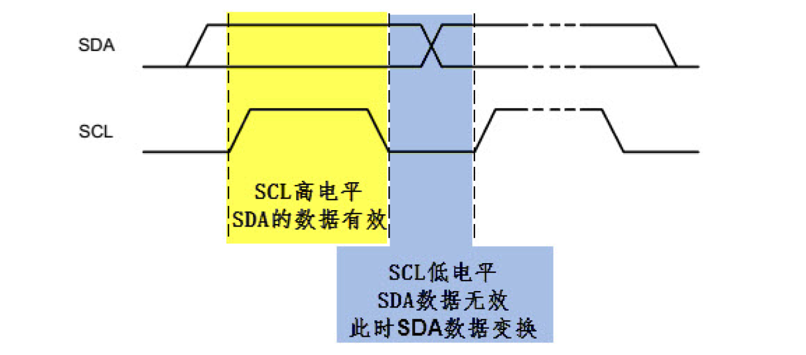

- 传输时，SCL 为高电平的时候 SDA 表示的数据有效，即此时的 SDA 为高电平时表示数据 “ 1 ”，为低电平时表示数据 “ 0 ”。
- 当SCL 为低电平时，SDA 的数据无效，一般在这个时候 SDA 进行电平切换，为下一次表示数据做好准备。

每次数据传输都以字节为单位，每次传输的字节数不受限制。

##### 2.4 地址及数据方向

I2C 总线上的每个设备都有自己的独立地址，主机发起通讯时，通过 SDA 信号线发送设备地址 ( SLAVE_ADDRESS ) 来查找从机。I2C 协议规定设备地址可以是 7 位或 10 位，实际中 7 位的地址应用比较广泛。

紧跟设备地址的一个数据位用来表示数据传输方向，它是数据方向位 ( R/ )，第 8 位或第 11 位。**数据方向位为 “ 1 ” 时表示主机由从机读数据，该位为 “ 0 ” 时表示主机向从机写数据。**

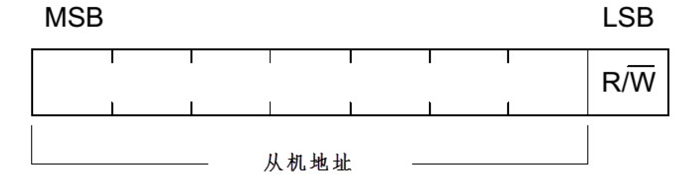

- 读数据方向时，主机会释放对 SDA 信号线的控制，由从机控制 SDA 信号线，主机接收信号。
- 写数据方向时，SDA 由主机控制，从机接收信号。

##### 2.5 响应

I2C 的数据和地址传输都带响应。响应包括 “ 应答( ACK ) ” 和 “ 非应答 ( NACK ) ” 两种信号。作为数据接收端时，当设备 ( 无论主从机 ) 接收到 I2C 传输的一个字节数据或地址后：

- 若希望对方**继续发送数据**，则需要向对方发送 “ **应答( ACK )** ” 信号，发送方会继续发送下一个数据；
- 若接收端希望**结束数据传输**，则向对方发送 “ **非应答( NACK )** ” 信号，发送方接收到该信号后会产生一个停止信号，结束信号传输。如下图。

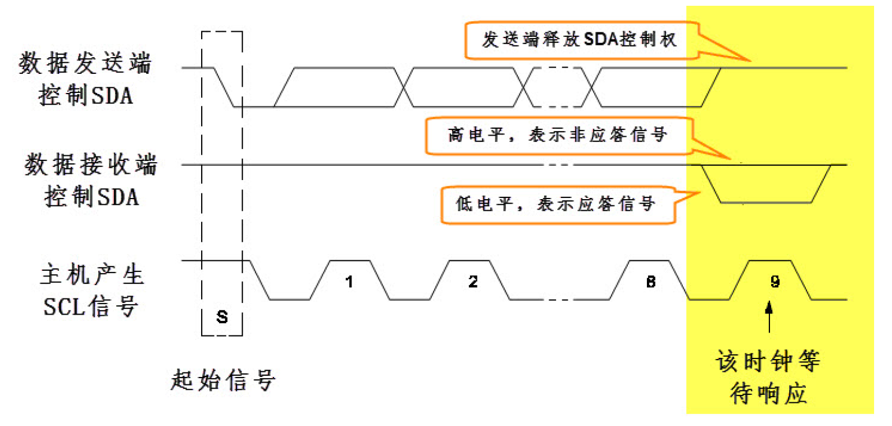

传输时主机产生时钟，在第 9 个时钟时，数据发送端会释放 SDA 的控制权，由数据接收端控制 SDA，若 SDA 为高电平，表示非应答信号 ( NACK )，低电平表示应答信号( ACK )。

### UART

### USB

### CAN

> <https://blog.csdn.net/XiaoXiaoPengBo/article/details/116206252>

## 网络编程

> 内容截取自：[野火]《Linux基础与应用开发实战指南—基于LubanCat-RK系列板卡》

互联网对人类社会产生的巨大变革，大家是有目共睹的，它几乎改变了人类生活的方方面面。互联网通信的本质是数字通信，任何数字通信都离不开通信协议的制定，通信设备只有按照约定的、统一的方式去封装和解析信息，才能实现通信。互联网通信所要遵守的众多协议，被统称为 TCP/IP。

### 1. 网络编程相关知识简介

TCP/IP 是一个协议族，包含众多的协议。但对于网络应用开发人员，可能听到更多的是其中的应用层协议，比如 HTTP、FTP、MQTT 等。

**HTTP** 协议是 Hyper Text Transfer Protocol（超文本传输协议）的缩写，HTTP 的应用最为广泛。比如大家日常使用电脑时的一个常规操作：打开电脑，打开浏览器，输入网址，最后按下回车，这一刻你就开启了 HTTP 通信。HTTP 协议工作于架构之上，（服务端也称作为服务器端，除非特别说明，否则本书出现的 “服务端” 即为 “服务器端”），浏览器作为 HTTP 客户端通过 URL 向 HTTP 服务端即 WEB 服务器发送所有请求。Web 服务器根据接收到的请求后，向客户端发送响应信息。借助这种浏览器和服务器之间的 HTTP 通信，我们能够足不出户地获得来自世界各个角落的信息。另外，网页不仅仅是大型服务器的专利，在物联网风潮盛行的今天，许多随处可见的小型设备（空调、冰箱、插座、路由器等），都内嵌网页，在物理链路畅通的情况下，用户可以用手机、平板电脑上的浏览器随时随地监控这些设备。

**FTP**（File Transfer Protocol）是文件传输协议的简称。FTP 是<mark>工作在应用层</mark>的网络协议。<mark>FTP 使得主机间可以共享文件，用于在两台设备之间传输文件（双向传输）</mark>。它也是一个<mark>客户端-服务端框架系统</mark>。用户可以通过一个支持 FTP 协议的客户端程序，连接到在远程主机上的 FTP 服务端程序，通过客户端程序向服务端程序发出命令，服务端程序执行用户所发出的命令，并将执行的结果返回到客户机。FTP 除了基本的文件上传/下载功能外，还有目录操作、权限设置、身份验证机制，许多网盘的文件传输功能都是基于 FTP 实现的。

在物联网发展的初期，物联网场景中的设备使用何种应用层协议进行通信一直是备受争议的话题。很多开发人员习惯了网页的开发模式，于是经常选择 HTTP 作为通信方式。使用 HTTP 有以下不利因素：HTTP 是一种同步协议，设备需要等待服务器的响应才可以进行下一步的工作，然而在设备数量多、网络不可靠的场景下，实现同步通信很困难；HTTP 是单向的，设备只能主动向服务器发出数据，无法被动的接收来自网络的数据，这不适用于实时控制的场合；HTTP 是有许多帧头和规则的重量级协议，实现在设备中需要耗费大量的系统资源。基于上述的形势，**MQTT** 和 **COAP** 等<mark>轻量级、异步的通信协议</mark>便得到了物联网设备开发商的宠爱，尤其是 MQTT。MQTT（消息队列遥测传输）是 IBM 公司于 1990 年设计并推出的一款通信协议，于 2014 年正式成为了一个 OASIS 开放标准。近年来，MQTT 的应用呈现出爆炸性的增长势头，大有一统物联网的趋势。另外，MQTT 在物联网以外的其他领域也得到了广泛的应用，比如许多公司在制作手机 APP 时，会使用 MQTT 来实现消息推送、即时聊天等功能。

嵌入式设备接入互联网的需求越来越大，有以下几点原因：

1. 近些年，各种带网络接入功能的 MCU、SoC 层出不穷，开源轻量的 TCP/IP 协议栈日趋成熟和完善，云平台的市场越来越繁荣，这些因素大大降低了嵌入式设备的入网成本，也为许多资源受限的低端设备接入互联网提供了可能。
2. “物联网+” 的风潮日渐盛行，设备能够被远程监控，这一点已经成为许多产品的技术要求。
3. 人们对于设备 “智能化” 的追求热情越来越高，当今热门的大数据、图像处理、语音识别、机器学习等功能都可以被集成在云端，成为云平台能提供的服务。终端设备大多是计算、存储能力有限的设备，这些设备如果想要获取 “智能”，最便捷的办法就是接入云平台，利用各项云服务。

互联网的基础就是 TCP/IP。TCP/IP 是一个非常复杂的协议族，即便我们能把它的设计思想和实现原理都解释得清清楚楚，你也不见得有时间和精力去学习它，所以本书的写作重点不在于对 TCP/IP 的解读，而在于对它的应用。另外，TCP/IP 的复杂性也决定了它并不是那么简单就能用好的东西，即便我们只关注应用开发，也依然需要对它的许多概念和设计思想有所了解，才能编写出正确、高效、健壮性好的应用程序。

互联网对人类社会产生的巨大变革，大家是有目共睹的，它几乎改变了人类生活的方方面面。互联网通信的本质是数字通信，任何数字通信都离不开通信协议的制定，通信设备只有按照约定的、统一的方式去封装和解析信息，才能实现通信。互联网通信所要遵守的众多协议，被统称为 TCP/IP。

#### 1.1 网络协议的分层模型

TCP/IP 是一个庞大的协议族，它是众多网络协议的集合，包括：ARP、IP、ICMP、UDP、TCP、DNS、DHCP、HTTP、FTP、MQTT 等等。这些协议按照功能，可以被划分为几个不同的层次，如图所示。比如 <mark>HTTP、FTP、MQTT，它们隶属于应用层</mark>。那么 <u>TCP/IP 为什么需要分层？</u><u>分层又是依靠什么依据呢？</u>

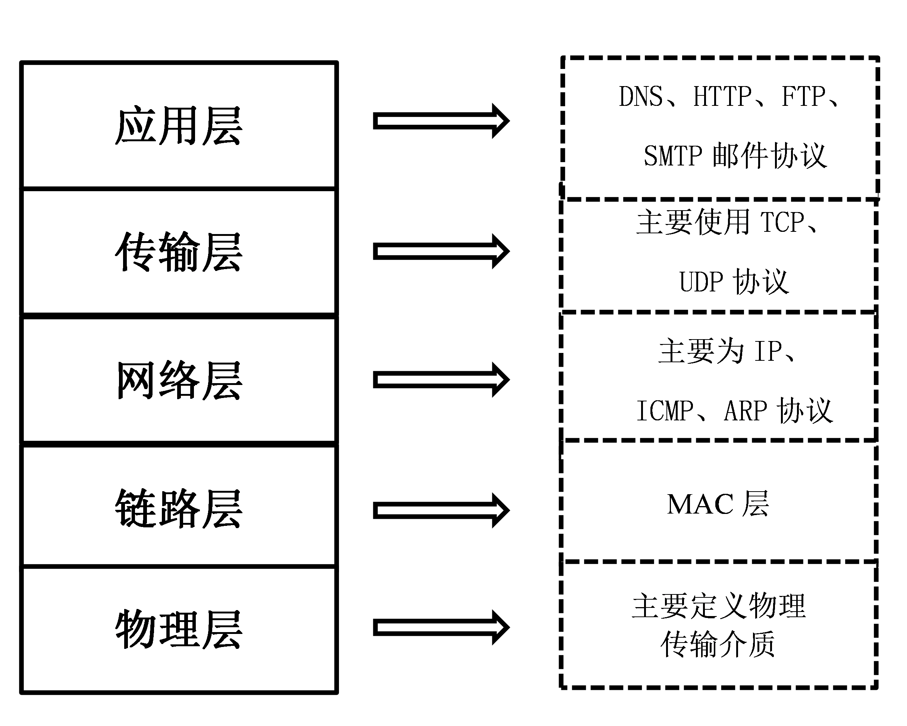

TCP/IP 协议栈中不同协议所完成的功能是不一样的，某些协议的实现要依赖于其它协议，依据这种依赖关系，可以将协议栈分层。在图中，<mark>低层协议为相邻的上层协议提供服务，是上层协议得以实现的基础。</mark>

其中，**物理层**（PHY）<mark>规定了传输信号所需要的物理电平、介质特征</mark>；

**链路层**（MAC）<mark>规定了数据帧能被网卡接收的条件</mark>，最常见的方式是利用网卡的 MAC 地址，发送方会在欲发送的数据帧的首部加上接收方网卡的 MAC 地址信息，接收方只有监听到属于自己的 MAC 地址信息后，才会去接收并处理该数据。

每台网络设备都应该有自己的网络地址，**网络层**<mark>规定了主机的网络地址该如何定义，以及如何在网络地址和 MAC 地址之间进行映射</mark>，即 ARP 协议；网络层<mark>实现了数据包在主机之间的传递</mark>，而一台主机内部可能运行着多个网络程序。

**传输层**可以<mark>区分数据包是属于哪一个应用程序的</mark>，可以说传输层<mark>实现了数据包端到端的传递</mark>。另外，数据包在传输过程中可能会出现丢包、乱序和重复的现象，网络层并没有提供应对这些错误的机制，而**传输层**可以<mark>解决数据包在传输过程中可能会出现丢包、乱序和重复的问题</mark>，如 TCP 协议；

应用层以下的工作完成了数据的传递工作，**应用层**则<mark>决定了你如何应用和处理这些数据</mark>，之所以会有许多的应用层协议，是因为互联网中传递的数据种类很多、差异很大、应用场景十分多样。

#### 1.2 协议层报文间的封装与拆封

在这里，我们简单解释一下在数据的发送和接收过程中，TCP/IP 都做了哪些事儿。

当用户发送数据时，将数据向下交给传输层，这是处于应用层的操作，而应用层也有相关的协议，对用户的数据进行封装，比如 MQTT、HTTP 等协议，最后应用层通过调用传输层的接口来将数据递交到传输层中。传输层会在数据前面加上传输层首部（此处以 TCP 协议为例，图中的传输层首部为 TCP 首部，也可以是 UDP 首部），然后向下交给网络层。同样地，网络层会在数据前面加上网络层首部（IP 首部），然后将数据向下交给链路层，链路层会对数据进行最后一次封装，即在数据前面加上链路层首部（此处使用以太网接口为例），然后将数据交给网卡。最后，网卡将数据转换成物理链路上的电平信号，数据就这样被发送到了网络中。数据的发送过程，可以概括为 TCP/IP 的各层协议对数据进行封装的过程，如图所示：

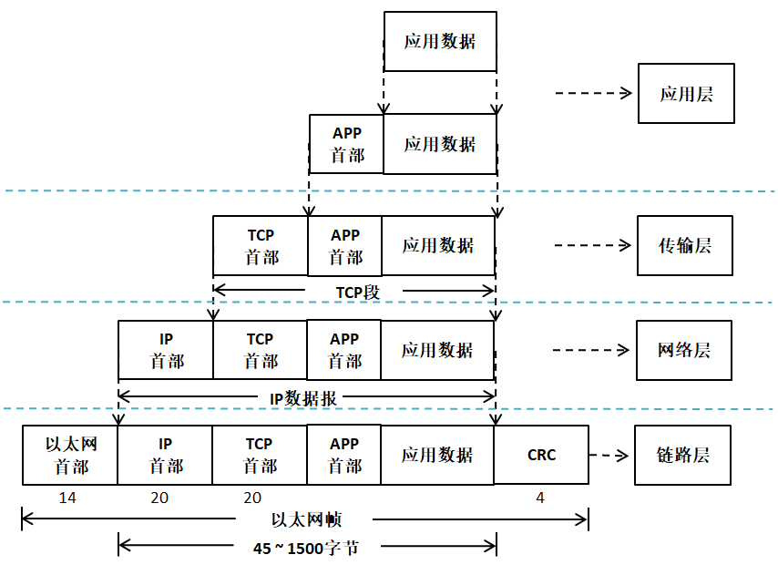

当设备的网卡接收到某个数据包后，它会将其放置在网卡的接收缓存中，并告知 TCP/IP 内核。然后 TCP/IP 内核就开始工作了，它会将数据包从接收缓存中取出，并逐层解析数据包中的协议首部信息，并最终将数据交给某个应用程序。数据的接收过程与发送过程正好相反，可以概括为 TCP/IP 的各层协议对数据进行解析的过程。

### 2. IP 协议

IP 协议（Internet Protocol），又称之为网际协议，IP 协议<mark>处于网络层工作</mark>，它<mark>是整个 TCP/IP 协议栈的核心协议</mark>，上层协议都要依赖 IP 协议提供的服务，IP 协议负责将数据报从源主机发送到目标主机，通过 IP 地址作为唯一识别码，简单来说，不同主机之间的 IP 地址是不一样的，在发送数据报的过程中，IP 协议还可能对数据报进行分片处理，同时在接收数据报的时候还可能需要对分片的数据报进行重装等等。

IP 协议是一种<mark>无连接的不可靠数据报交付协议</mark>，<u>协议本身不提供任何的错误检查与恢复机制</u>。

#### 2.1 IP 地址简述

在 TCP/IP 设计之初，为了标识互联网中的每台主机的身份，设计人员为每个接入网络中的主机都分配一个 IP 地址（Internet Protocol Address），是一个 32 位的整数地址，只有合法的 IP 地址才能接入互联网中并且与其他主机进行通信，<mark>IP 地址是软件地址</mark>，不是硬件地址，<u>硬件 MAC 地址是存储在<mark>网卡</mark>中的，应用于<mark>本地网络</mark>中寻找目标主机</u>。而 <mark>IP 地址能让一个网络中的主机能够与另一个网络中的主机进行通信，无需理会这些主机之间的 MAC 地址</mark>。

在学习 IP 地址之前，需要简述一下主机与路由器连入网络的通信的方法：一台主机通常只有一条链路连接到网络，一般只有一个网卡；当主机中想发送一个数据报时，它就在该链路上发送，一个网卡对应一个 MAC 地址与 IP 地址，当然，主机也可能有多个网卡，这样子主机就有多个 MAC 地址与 IP 地址。

每个 IP 地址长度为 32 比特（4 字节），因此总共有 2^32 个可能的 IP 地址，大约有 40 亿个 IP 地址能被使用的。这些地址一般按所谓<mark>点分十进制记法</mark>（dotted-decimal notation）书写，<u>即地址中的每个字节用它的十进制形式书写，各字节间以点分隔开</u>。例如，IP 地址为 `192.168.0.122`，`192` 是该地址第一个 8 比特的十进制等价数，`168` 是该地址第二个 8 比特的十进制等价数，依此类推。

##### 2.2 IP 地址编址

在全球的互联网中，每个主机都要唯一的一个 IP 地址作为身份识别，那么这么多 IP 地址是怎么样分配的呢？这不可能是随意自由选择 IP 地址的，实际上<mark>每个主机的 IP 地址的一部分都由其所在的子网决定的</mark>，所以又出现了IP 地址分类编址的概念，<mark>网络的类型决定了 IP 地址将如何划分成网络部分和节点部分</mark>，在分类编址中，设计者把所有的 IP 地址划分为 5 大类，分别为 A、B、C、D、E 五类，每一类地址都觉定了其中 IP 地址的一部分组成，具体见：

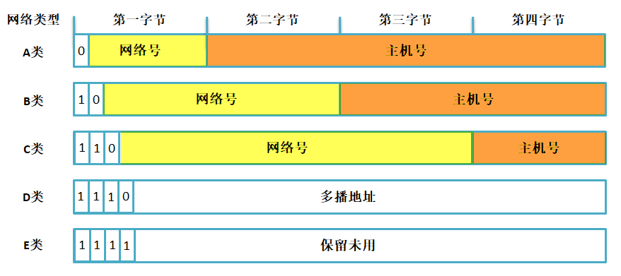

A 类网络地址的第一个字节的第一位必须为 0 ，因此，A 类网络地址第一个字节的取值范围为 0~127（注意：但 0 和 127 不是有效的 A 类网络地址号），A 类地址总共有 128 个网络号，其中 3 个网络号用作特殊用途，因此可以在互联网上使用的还有125 个，而每一个网络号后面的 3 字节主机号表示能用于 A 类网络地址不同网络号的的主机数量（多达 2^24-2 = 16777214 个），所以总的来说 A 类网络支持的主机数量为 125*16777214=2097151750 个，大约占据了 40 亿 IP 地址的半壁江山，这些 IP 地址通常被分配给世界上超大型的机构使用，但是通常没有任何一个机构能使用那么大量的 IP 地址，所以 A 类地址的很多 IP 地址都会被白白浪费掉。

B 类网络地址的第一个字节的第一位必须为 1 ，且第二位必须为 0，因此，B 类网络地址第一个字节的取值范围为 128~191，前 2 字节剩余的 14bit 表示网络号，多达 16384 个网络号，其中 16个网络号被保留使用，因此可以分配给企业使用的网络号有16368 个，每一个网络号中可以拥有 2^16-2 =65534 个主机，总的来说 B 类网络支持的主机个数为16368*65534=1072660512，大约占据了所有 IP 地址的四分之一。

C 类网络地址的第一个字节的第一位必须为 1，第二位必须为 1，第三位必须为 0，因此 C 类网络第一个字节的取值范围为192~223，C 类地址的前三个字节用于表示网络号（剩下的 21bit），所以拥有 2097152 个网络号，但是其中的 256 个网络号被保留出来，因此 C 类地址的可用网络号为 2096896 个，每个网络号下的主机个数为 254，因此 C 类网络支持的主机数量为532611584，大约占据了所有 IP 地址的八分之一。

D 类 IP 地址的第一个字节前四位为 1110，那么它第一个字节的取值范围为 224~239，约占据了所有 IP 地址的十六分之一，它是一个专门保留的地址，它并不指向特定的网络，目前这一类地址被用于多播。

E 类 IP 地址的第一个字节前四位必须为 1111，那么它第一个字节的取值范围为 240~255，约占据了所有 IP 地址的十六分之一，是为将来使用而保留的，其中 32bit 全为 1 的 IP 地址（255.255.255.255）用作广播地址。

| 类别 | 第一字节(二进制) | 第一字节取值范围 | 网络号个数 | 主机号个数 | 适用范围 |
| :--: | :--------------: | :--------------: | :--------: | :--------: | :------: |
| A 类 |    0XXX XXXX     |      0~127       |    125     |  16777214  | 大型网络 |
| B 类 |    10XX XXXX     |     128~191      |   16368    |   65534    | 中型网络 |
| C 类 |    110X XXXX     |     192~223      |  2097152   |    254     | 小型网络 |
| D 类 |    110X XXXX     |     224~239      |     —      |     —      |   多播   |
| E 类 |    1111 XXXX     |     240~255      |     —      |     —      |   保留   |

##### 2.3 特殊的 IP 地址

除了上述的网络地址外，还有一些特殊用途的地址，这些地址是不允许分配给任何一个网络的主机使用的，下面简单介绍几个常见的特殊地址。

###### 2.3.1 受限广播地址

广播通信是<mark>一对所有</mark>的通信方式，受限广播地址<mark>用于定义整个互联网</mark>，如果设备想使 IP 数据报被整个网络所接收，就发送这个目的地址全为 1 的广播包，但这样会给整个互联网带来灾难性的负担，所以<u>在任何情况下，路由器都会禁止转发目的地址为`255.255.255.255` 的广播数据包</u>，因此这样的数据包仅会出现在本地网络中（局域网），`255.255.255.255` 这个地址指本网段内的所有主机，相当于 “房子里面的人都听着” 通知所有主机。

> [!caution]
>
> 此处不要与以太网的广播地址（`255-255-255-255-255-255`）混淆了。

###### 2.3.2 直接广播地址

受限<mark>广播地址是网络号与主机号都为 1</mark> 的地址，但是<mark>直接广播地址是主机号全为 1</mark> 而得到的地址，<mark>广播地址代表本网络内的所有主机</mark>，<u>使用该地址可以向网络内的所有主机发送数据</u>，比如一个 IP 地址是 `192.168.0.181`，这是 C 类地址，所以它的主机号只有一个字节，那么对主机号全取 1 得到一个广播地址 `192.168.0.255`，向这个地址发送数据就能让同一网络下的所有主机接收到。

A、B、C 三类地址的广播地址结构如下：

- A 类地址的广播地址为：`XXX.255.255.255`（ `XXX` 为 A 类地址的第一个字节取值范围）。
- B 类地址的广播地址为：`XXX.XXX.255.255`（`XXX` 为 B 类地址的前两个字节取值范围）。
- C 类地址的广播地址为：`XXX.XXX.XXX.255`（ `XXX` 为 C 类地址的前三个字节取值范围）。

> [!caution]
>
> 这个地址在 IP 数据报中只能作为**目的地址**。另外，直接广播地址使一个网段中可分配给设备的地址数减少了 1 个。

###### 2.3.3 多播地址

多播地址<mark>用在一对多的通信中</mark>，即一个发送者，多个接收者，不论接收者数量的多少，发送者只发送一次数据包。多播地址<mark>属于分类编址中的 D 类地址</mark>，<u>D 类地址只能用作<mark>目的地址</mark>，而不能作为主机中的<mark>源地址</mark></u>。

###### 2.3.4 环回地址

`127` 网段的<mark>所有</mark>地址都称为环回地址，<mark>主要用来测试网络协议是否工作正常的作用</mark>。比如在电脑中使用 `ping` 命令去 `ping 127.1.1.1` 就可以测试本地 TCP/IP 协议是否正常。用通俗的话表示，就是 “我自己”，不能以 `127` 网段中的 IP 地址作为主机地址，因此 A 类地址又少了一个可用网络号。

###### 2.3.5 本网络本主机

IP 地址 32bit 全为 0 的地址（0.0.0.0）表示的是本网络本主机，这个 IP 地址<u>在 IP 数据报中只能用作<mark>源 IP 地址</mark></u>，这<u>发生在当设备启动时但又不知道自己的 IP 地址情况下</u>。在使用 DHCP 分配 IP地址的网络环境中，这样的地址是很常见的，主机为了获得一个可用的 IP 地址，就给 DHCP 服务器发送 IP 数据报，并用这样的地址（0.0.0.0）作为源地址，目的地址为255.255.255.255（因为主机这时还不知道 DHCP 服务器的 IP 地址），然后 DHCP 服务器就会知道这个主机暂时没有 IP 地址，那么就会分配一个 IP 给这个主机。

### 3. UDP 协议

UDP 是 User Datagram Protocol 的简称，中文名是用户数据报协议，是一种<mark>无连接、不可靠</mark>的协议，它只是<u>简单地实现从一端主机到另一端主机的数据传输功能</u>，这些数据通过 IP 层发送，在网络中传输，到达目标主机的顺序是无法预知的，因此需要应用程序对这些数据进行排序处理，这就带来了很大的不方便，此外，UDP 协议更<u>没有流量控制、拥塞控制</u>等功能，在发送的一端，UDP 只是把上层应用的数据封装到 UDP 报文中，在差错检测方面，仅仅是对数据进行了简单的校验，然后将其封装到 IP 数据报中发送出去。而在接收端，无论是否收到数据，它都不会产生一个应答发送给源主机，并且如果接收到数据发送校验错误，那么接收端就会丢弃该 UDP 报文，也不会告诉源主机，这样子传输的数据是无法保障其准确性的，如果想要其准确性，那么就需要应用程序来保障了。UDP 协议的特点：

1. <mark>无连接、不可靠</mark>。
2. <mark>尽可能提供交付</mark>数据服务，出现差错直接丢弃，无反馈。
3. <mark>面向报文</mark>，发送方的 UDP 拿到上层数据直接添加个 UDP 首部，然后进行校验后就递交给 IP 层，而接收的一方在接收到 UDP 报文后简单进行校验，然后直接去除数据递交给上层应用。
4. 支持一对一，一对多，多对一，多对多的交互通信。
5. <mark>速度快</mark>，UDP 没有 TCP 的握手、确认、窗口、重传、拥塞控制等机制，UDP 是一个<mark>无状态的传输协议</mark>，所以它在传递数据时非常快，即使<u>在网络拥塞的时候 UDP 也不会降低发送的数据</u>。

UDP 虽然有很多缺点，但是也不排除其能用于很多场合，因为在如今的网络环境下，UDP 协议传输出现错误的概率是很小的，并且它的实时性是非常好，常用于实时视频的传输，比如直播、网络电话等，因为即使是出现了数据丢失的情况，导致视频卡帧，这也不是什么大不了的事情，所以，UDP 协议还是会<u>被应用与对传输速度有要求，并且可以容忍出现差错的数据传输中</u>。

### 4. TCP 协议

#### 4.1 TCP 协议简介

TCP 与 UDP 一样，都是传输层的协议，但是提供的服务却大不相同，UDP 为上层应用提供的是一种不可靠的，无连接的服务，而 <u>TCP 则提供一种==面向连接==、==可靠==的字节流传输服务</u>，TCP 让两个主机建立连接的关系，<u>应用数据以==数据流==的形式进行传输</u>，这与 UDP 协议是不一样：

- <u>UDP 运载的数据是以==报文==的形式</u>，各个报文在网络中==互不相干传输==，UDP 每收到一个报文就递交给上层应用，因此如果对于大量数据来说，应用层的重装是非常麻烦的，因为 <u>UDP 报文在网络中==到达目标主机的顺序是不一样==的</u>；
- <u>而 TCP 采用==数据流==的形式传输</u>，先后发出的数据在网络中虽然也是==互不相干的传输==，但是这些<u>数据本身携带的信息</u>却是紧密联系的，<u>TCP 协议会给每个传输的字节进行==编号==</u>，当然啦，<u>两个主机方向上的数据编号是==彼此独立==的</u>，在传输的过程中，<u>发送方把数据的==起始编号==与==长度==放在 TCP 报文中，在接收方将所有数据==按照编号组装==起来，然后返回一个确认</u>，当所有数据接收完成后才将数据递交到应用层中。

#### 4.2 TCP 的特性

##### 4.2.1 连接机制

TCP 是一个面向连接的协议，无论哪一方向另一方发送数据之前，<u>都必须先在双方之间建立一个连接</u>，否则将无法发送数据，一个 TCP 连接必须有双方 IP 地址与端口号，就像打电话一样，必须知道双方的电话号码才会打电话，关于具体的连接我们在后文讲解。

##### 4.2.2 确认与重传

一个完整的 TCP 传输必须有数据的交互，<u>接收方在接收到数据之后必须正面进行确认</u>，向发送方报告接收的结果，而发送方在发送数据之后必须等待接收方的确认，同时发送的时候会启动一个定时器，在指定超时时间内没收到确认，发送方就会认为发送失败，然后进行重发操作，这就是重传报文。

TCP 提供可靠的运输层，但它依赖的是 IP 层的服务，IP 数据报的传输是无连接、不可靠的，因此它要通过确认来知道接收方确实已经收到数据了。但数据和确认都有可能会丢失，因此 TCP 通过在发送时设置一个<u>超时机制</u>（定时器）来解决这种问题，如果当超时时间到达的时候还没有收到对方的确认，它就重传该数据。

##### 4.2.3 缓冲机制

在发送方想要发送数据的时候，由于应用程序的数据大小、类型都是不可预估的，而 TCP 协议提供了缓冲机制来处理这些数据，如<u>在数据量很小的时候，TCP 会将数据存储在一个缓冲空间中，等到数据量足够大的时候在进行发送数据</u>，这样子能<u>提高传输的效率并且减少网络中的通信量</u>，而且在数据发送出去的时候并不会立即删除数据，还是让数据保存在缓冲区中，因为发送出去的数据不一定能被接收方正确接收，它需要等待到接收方的确认再将数据删除。同样的，在接收方也需要有同样的缓冲机制，因为在网络中传输的数据报到达的时间是不一样的，而且 TCP 协议还需要把这些数据报组装成完整的数据，然后再递交到应用层中。

##### 4.2.4 全双工通信

在 TCP 连接建立后，那么两个主机就是对等的，任何一个主机都可以向另一个主机发送数据，数据是双向流通的，所以 TCP 协议是一个全双工的协议，这种机制为 TCP 协议传输数据带来很大的方便，一般来说，<u>TCP 协议的确认是通过==捎带==的方式来实现</u>，即接收方把确认信息放到反向传来的是数据报文中，不必单独为确认信息申请一个报文，<u>捎带机制减少了网络中的通信流量。</u>由于双方主机是对等的存在，那么任意一方都可以断开连接，此时这个方向上的数据流就断开了，但是另一个方向上的数据仍是连通的状态，这种情况就称之为半双工。

##### 4.2.5 流量控制

在前面讲过，一条 TCP 连接每一侧的主机都设置了缓冲区域。当该接收方收到数据后，它就将数据放入接收缓冲区，当确认这段数据是正常的时候，就会向发送方返回一个确认。并且向相关的应用层递交该数据，但不一定是数据刚一到达就立即递交。事实上，接收方应用也许正忙于其他任务，甚至要过很长时间后才会去处理这些数据。这样子如果接收方处理这些数据时相对缓慢，而发送方发送得太多、太快，就会很容易地使接收方的接收缓冲区发生溢出。

因此 TCP 提供了流量控制服务（flow-control service）以<u>消除发送方使接收方==缓冲区溢出==的可能性</u>。<u>流量控制是一个==速度匹配服务==，即发送方的发送速率与接收方应用程序的读取速率相匹配</u>，TCP 通过让发送方维护一个称为==接收窗口==（receive window）的变量来提供流量控制，是的，你没看错，是接收窗口（rwnd），它<u>用于给发送方一个指示：接收方还能接收多少数据</u>，接收方会将此窗口值放在 TCP 报文的首部中的窗口字段，然后传递给发送方，这个窗口的大小是在发送数据的时候==动态调整==的。

那可能有人问，这个窗口既然是动态调整的，那有没有可能是 0，这样子发送方不就是没法继续发送数据到接收方了？为了解决这个问题，TCP 协议的规范中有些要求，当接收方主机的接收窗口为 0 时，发送方继续发送只有一个字节的报文段，这些报文段将被接收方接收，直到缓存清空，并在确认报文中包含一个非 0 的接收窗口值。

流量控制是双方通信之间的控制信息，这是很有必要的，比如两个性能不对等的主机，建立了 TCP 协议连接，但是其中一个主机一直发送数据，但是接收的主机来不及处理，这样子的处理就不是最佳的，因此，<u>TCP 协议中使用==滑动窗口==的流量控制方法，它允许接收方==根据自身的处理能力来确定能接收数据的多少==</u>，因此会告诉发送方可以发送多少数据过来，即窗口的大小，而发送方尽可能将数据都多发到对方那里，所以发送方会根据这个窗口的大小发送对应的数据，通俗地来说就是接收方告诉发送方 “我还有能力处理那么多的数据，你就发那么多数据给我就行了，不要发多了，否则我处理不了”。

##### 4.2.6 差错控制

除了确认与重传之外，TCP 协议也会<u>采用校验和的方式来检验数据的有效性</u>，主机在接收数据的时候，会将重复的报文丢弃，将乱序的报文重组，发现某段报文丢失了会请求发送方进行重发，因此在 <u>TCP 往上层协议递交的数据是==顺序的==、==无差错的==完整数据。</u>

##### 4.2.7 拥塞控制

什么是拥塞？当数据从一个大的管道（如一个快速局域网）向一个较小的管道（如一个较慢的广域网）发送时便会发生拥塞。当多个输入流到达一个路由器，而路由器的输出流小于这些输入流的总和时也会发生拥塞，这种是网络状况的原因。如果一个主机还是以很大的流量给另一个主机发送数据，但是其中间的路由器通道很小，无法承受这样大的数据流量的时候，就会导致拥塞的发生，这样子就<u>导致了接收方无法在超时时间内完成接收（接收方此时完全有能力处理大量数据），而发送方又进行重传，这样子就导致了链路上的更加拥塞</u>，<u>延迟发送方必须实现一种==自适应的机制==，在网络中拥塞的情况下==调整自身的发送速度==，这种形式对发送方的控制被称为拥塞控制（congestion control）</u>，与前面我们说的流量控制是非常相似的，而且TCP 协议采取的措施也非常相似，均是==限制发送方的发送速度==。

#### 4.3 端口号的概念

TCP 协议的连接是包括上层应用间的连接，简单来说，TCP 连接是两个不同主机的应用连接，而传输层与上层协议是通过端口号进行识别的，如 IP 协议中以 IP 地址作为识别一样，端口号的取值范围是 0~65535，这些端口标识着上层应用的不同线程，一个主机内可能只有一个 IP 地址，但是可能有多个端口号，每个端口号表示不同的应用线程。一台拥有 IP 地址的主机可以提供许多服务，比如 Web 服务、FTP 服务、SMTP 服务等，这些服务完全可以通过 1 个 IP 地址来实现，主机是怎样区分不同的网络服务呢？显然不能只靠 IP 地址，因为 IP 地址只能识别一台主机而非主机提供的服务，这些服务就是主机上的应用线程，因此是<u>通过 “IP 地址+ 端口号” 来区分主机不同的线程</u>。

常见的 TCP 协议端口号有 21、53、80 等等，更多端口描述具体见表格，其中 80 端口号是我们日常生活中最常见的一个端口号，它也是 HTTP 服务器默认开放的端口。

| 端口号 |  协议  | 说明                                                         |
| :----: | :----: | ------------------------------------------------------------ |
| 20/21  |  FTP   | 文件传输协议，使得主机间可以共享文件。                       |
|   23   | Telnet | 终端远程登录，它为用户提供了在本地计算机上完成远程主机工作的能力。 |
|   25   |  SMTP  | 简单邮件传输协议，它帮助每台计算机在发送或中转信件时找到下一个目的地。 |
|   69   |  TFTP  | 普通文件传输协议。                                           |
|   80   |  HTTP  | 超文本传输协议，通过使用网页浏览器、网络爬虫或者其它的工具，客户端发起一个 HTTP 请求到服务器上指定端口（默认端口为 80），应答的服务器上存储着一些资源，比如 HTML 文件和图像，那么就会返回这些数据到客户端。 |
|  110   |  POP3  | 邮局协议版本 3，本协议主要用于支持使用客户端远程管理在服务器上的电子邮件。 |

举个例子，我们访问 <http://www.firebbs.cn> 这个网站，如果我们在浏览器中输入 <http://www.firebbs.cn:80> ，访问这个服务器的 80 端口，我们还是会进入一样的页面，但是如果我们输入 <http://www.firebbs.cn:90> 去访问这个服务器的 90 端口，这是不允许访问的。

#### 4.4 TCP 报文段

TCP 报文段由<u>首部 + 数据区域</u>组成，TCP 报文段的首部我们称之为 TCP 首部，其首部内容很丰富，各个字段都有不一样的含义，如果不计算选项字段，一般来说 TCP 首部只有 20 个字节，具体见图：

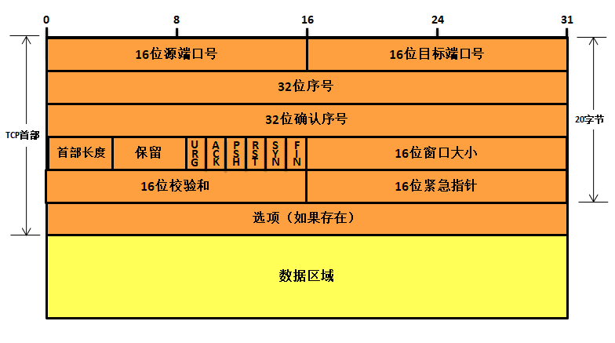

每个 TCP 报文段都包含<u>源主机和目标主机的端口号</u>，用于寻找发送端和接收端应用线程，这两个值加上 IP 首部中的<u>源 IP 地址和目标 IP 地址</u>就能确定唯一一个TCP 连接。

序号字段用来标识从 TCP 发送端向 TCP 接收端发送的数据字节流，它的值表示在这个报文段中的第一个数据字节所处位置，根据接收到的数据区域长度，就能计算出报文最后一个数据所处的序号，因为 TCP 协议会对发送或者接收的数据进行编号（按字节的形式），那么使用序号对每个字节进行计数，就能很轻易管理这些数据。序号是 32 bit 的无符号整数。

当建立一个新的连接时，TCP 报文段首部的 SYN 标志变 1，序号字段包含由这个主机随机选择的初始序号 ISN（Initial Sequence Number）。该主机要发送数据的第一个字节序号为 ISN+1，因为 SYN 标志会占用一个序号，在这里我们只需要了解一下即可，后面会讲解的。

既然 TCP 协议给每个传输的字节都进行了编号，那么确认序号就包含接收端所期望收到的下一个序号，因此，确认序号应当是上次已成功收到数据的最后一个字节序号加 1。当然，只有 ACK标志为 1 时确认序号字段才有效，TCP 为应用层提供全双工服务，这意味数据能在两个方向上独立地进行传输，因此确认序号通常会与反向数据（即接收端传输给发送端的数据）封装在同一个报文中（即捎带），所以连接的每一端都必须保持每个方向上的传输数据序号准确性。

首部长度字段占据 4bit 空间，它指出了 TCP 报文段首部长度，以字节为单位，最大能记录 15*4=60 字节的首部长度，因此， TCP 报文段首部最大长度为 60 字节。在字段后接下来有 6bit 空间是保留未用的。

此外还有 6bit 空间，是TCP 报文段首部的标志字段，用于标志一些信息：

- URG：首部中的紧急指针字段标志，如果是 1 表示紧急指针字段有效。
- ACK：首部中的确认序号字段标志，如果是 1 表示确认序号字段有效。
- PSH：该字段置 1 表示接收方应该尽快将这个报文段交给应用层。
- RST：重新建立 TCP 连接。
- SYN：用同步序号发起连接。
- FIN：中止连接。

TCP 的流量控制由连接的每一端通过声明的窗口大小来提供，窗口大小为字节数，起始于确认序号字段指明的值，这个值是接收端期望接收的数据序号，发送方根据窗口大小调整发送数据，以实现流量控制。窗口大小是一个占据 16 bit 空间的字段，因而窗口最大为 65535 字节，当接收方告诉发送方一个大小为 0 的窗口时，将完全阻止发送方的数据发送。

检验和覆盖了整个的 TCP 报文段：TCP 首部和 TCP 数据区域，由发送端计算和填写，并由接收端进行验证。

只有当 URG 标志置 1 时紧急指针才有效，紧急指针是一个正的偏移量，和序号字段中的值相加表示紧急数据最后一个字节的序号。简单来说，TCP 报文段的紧急数据在报文段数据区域中，从序号字段开始，偏移紧急指针的值结束。

选项字段用途不多，暂时无需理会。

#### 4.5 TCP 建立连接

TCP 是一个面向连接的协议，无论哪一方向另一方发送数据之前，都必须先在双方之间建立一条连接，俗称“握手”，可能在学习网络之前，大家或多或少都听过 “**三次握手**”、“**四次挥手**” 这两个词汇，那么 “三次握手”、“四次挥手” 是怎么样的呢？本小节将详细讨论一个 TCP 连接是如何建立的以及通信结束后是如何终止的。

“**三次握手**” 建立连接：

首先建立==连接的过程是由客户端发起==，而服务器无时无刻都在等待着客户端的连接，其示意图具体见图，TCP 连接一般来说会经历以下过程：

1. 客户端的 TCP 首先向服务器端的 TCP 发送一个特殊的 TCP 报文段。该报文段中不包含应用层数据，但是在报文段的首部中的 ==SYN 标志位会被置为 1==。因此，这个特殊报文段被称为 SYN 报文段（我们暂且称之为握手请求报文）。另外，客户会随机地选择一个==初始序号==（ISN，假设==为 A==），并将此序号放置于该 SYN 报文段的序号字段中；但 SYN 报文段中的 ==ACK 标志位 0==，此时它的<u>确认序号段是无效的</u>。该报文段会被封装在一个 IP 数据报中，然后发送给目标服务器。

2. 一旦服务器收到了客户端发出的 SYN 报文段，知道客户端要请求握手了，服务器便会从 SYN 报文段中提取对应的信息，为该 TCP 连接分配 TCP 缓存和变量，并向该客户 TCP 发送允许连接的报文段（握手应答报文）。这个报文段同样也不包含任何应用层数据，但是，在报文段的首部却包含 3 个重要的信息。

    1. ==SYN 与 ACK 标志都被置为 1==。
    2. 将 TCP 报文段首部的==确认序号字段设置为 A+1==（这个 A（ISN）是从握手请求报文中得到）。
    3. 服务器随机选择自己的==初始序号==（ISN，注意此 ISN 是服务器端的 ISN，假设==为 B==），并将其放置到 TCP 报文段首部的序号字段中。

    这个允许连接的报文段实际上表明了：“我收到了你发起建立连接的请求，初始序号为 A，我同意建立该 TCP 连接，我自己的初始序号是 B。”该允许连接的报文段有时被称为 SYN ACK 报文段（SYN ACK segment），同时由于 ACK 标志位 1，所以 TCP 报文段首部的窗口大小字段是有效的。

3. 当客户端收到服务器的握手应答报文后，会将 ACK 标志置位，此时客户端的 TCP 报文段的 ==ACK 标志被设置为 1==，而对于 ==SYN 标志==，因为连接已经建立了，所以该标志会被==置为 0==，同时客户端也要给该 TCP 连接分配缓存和变量，并且客户端还需要返回一个应答报文段，这个报文对服务器的应答报文段作出应答，将 TCP 报文段首部的==确认序号字段设置为 B+1==，同时也会告知服务器的窗口大小。

    > [!note]
    >
    > 在三次握手的第三个阶段可以在报文段数据区域中携带客户端到服务器的数据。

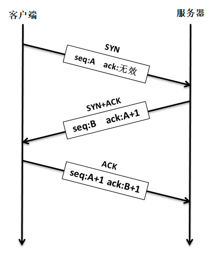

在完成握手后，客户端与服务器就建立了连接，同时双方都得到了彼此的窗口大小，序列号等信息，在传输 TCP 报文段的时候，每个 TCP 报文段首部的 SYN 标志都会被置 0，因为它只用于发起连接，同步序号。

#### 4.6 TCP 终止连接

建立一个连接需要三次握手，而终止一个连接要经过四次挥手（有一些书上也会称为“四次握手”），这由 TCP 的特性造成的，因为 TCP 连接是全双工连接的服务，因此每个方向上的连接必须单独关闭。当一端完成它的数据发送任务后就能发送一个 FIN 报文段（可以称之为终止连接请求，其实就是 FIN 标志位被设置为1）来终止这个方向上的连接。另一端收到一个 FIN 报文段，它必须通知应用层对方已经终止了那个方向的连接，发送 FIN 报文段通常是应用层进行关闭的结果。

> [!caution]
>
> 客户端发送一个 FIN 报文段只意味着在这一方向上没有数据流动，一个 TCP 连接在发送一个 FIN 后仍能接收数据，但是在实际应用中只有很少的 TCP 应用程序这样做。

“**四次挥手**” 终止连接具体过程如下：

1. 客户端发出一个 FIN 报文段主动进行关闭连接，此时报文段的 ==FIN 标志位为 1==，假设==序号为 C==，一般来说 ==ACK 标志也会被置 1==，但==确认序号字段是无效==的。
2. 当服务器收到这个 FIN 报文段，它发回一个 ACK 报文段（此报文段是终止连接应答），==确认序号为收到的序号加 1（C+1）==，和 SYN 一样，一个 FIN 将占用一个序号，此时断开客户端 -> 服务器的方向连接。
3. 服务器会向应用程序请求关闭与这个客户端的连接，接着服务器就会发送一个 FIN 报文段（这个报文段是服务器向客户端发出，请求终止连接），此时假设==序号为 D==，==ACK 标志虽然也为 1==，但是==确认序号字段是无效==的。
4. 客户端返回一个 ACK 报文段来确认终止连接的请求，==ACK 标志置 1==，并将==确认序号设置为收到序号加 1（D+1）==，此时断开服务器 -> 客户端的方向连接。

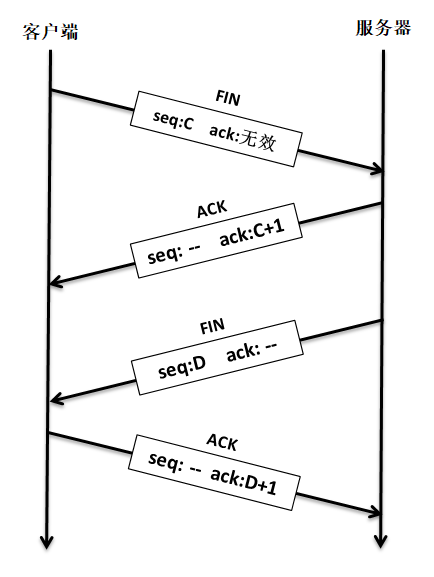

#### 4.7 TCP 状态

TCP 协议根据连接时接收到报文的不同类型，采取相应动作也不同，还要处理各个状态的关系，如收到握手报文时候、超时的时候、用户主动关闭的时候等都需要不一样的状态去采取不一样的处理。

TCP 协议的状态如下：

- *LISTENING* 状态：提供某种服务，侦听远方 TCP 端口的连接请求，当提供的服务没有被连接时，处于 *LISTENING* 状态，端口是开放的，等待被连接。
- *SYN_SENT* (客户端状态)：客户端调用 `connect()` 函数，将会发送一个 SYN 请求建立一个连接，在发送连接请求后等待匹配的连接请求，此时状态为 *SYN_SENT*。
- *SYN_RECEIVED* (服务端状态)：在收到和发送一个连接请求后，等待对方对连接请求的确认，当服务器收到客户端发送的同步信号时，将标志位 ACK 和 SYN 置 1 发送给客户端，此时服务器端处于 *SYN_RCVD* 状态，如果连接成功了就变为  *ESTABLISHED*，正常情况下 *SYN_RCVD* 状态非常短暂。
- *ESTABLISHED* 状态：这个状态是处于稳定连接状态，建立连接的 TCP 协议两端的主机都是处于这个状态，它们相互知道彼此的窗口大小、序列号、最大报文段等信息。
- *FIN_WAIT_1* 与 *FIN_WAIT_2* 状态：处于这个状态一般都是单向请求终止连接，然后主机等待对方的回应，而如果对方产生应答，则主机状态转移为 *FIN_WAIT_2*，此时 {主机-> 对方} 方向上的 TCP 连接就断开，但是 {对方-> 主机} 方向上的连接还是存在的。此处有一个注意的地方：如果主机处于 *FIN_WAIT_2* 状态，说明主机已经发出了 FIN 报文段，并且对方也已对它进行确认，除非主机是在实行半关闭状态，否则将等待对方主机的应用层处理关闭连接，因为对方已经意识到它已收到 FIN 报文段，它需要主机发一个 FIN 来关闭 {对方->主机} 方向上的连接。只有当另一端的进程完成这个关闭，主机这端才会从*FIN_WAIT_2* 状态进入*TIME_WAIT* 状态。否则这意味着主机这端可能永远保持这个 *FIN_WAIT_2* 状态，另一端的主机也将处于 *CLOSE_WAIT* 状态，并一直保持这个状态直到应用层决定进行关闭。
- *CLOSE-WAIT* 状态：等待从本地用户发来的连接中断请求，被动关闭端 TCP 接到 FIN 后，就发出 ACK 以回应 FIN 请求(它的接收也作为文件结束符传递给上层应用程序), 并进入 *CLOSE_WAIT*.
- *TIME_WAIT* 状态：*TIME_WAIT* 状态也称为 2MSL 等待状态。每个具体 TCP 连接的实现必须选择一个 TCP 报文段最大生存时间 MSL（Maximum Segment Lifetime），如 IP 数据报中的 TTL 字段，表示报文在网络中生存的时间，它是任何报文段被丢弃前在网络内的最长时间，这个时间是有限的，<u>为什么需要等待呢？</u>我们知道 IP 数据报是不可靠的，而 TCP 报文段是封装在 IP 数据报中，TCP 协议必须保证发出的 ACK 报文段是正确被对方接收，因此处于该状态的主机必须在这个状态停留最长时间为 2 倍的 MSL，以防最后这个 ACK 丢失，因为 TCP 协议必须保证数据能准确送达目的地。

讲了那么多理论，下面就结合图文来详解一下 TCP 协议在建立连接与终止连接的时候所有的状态转移处理是怎么样的，具体见下图：

> [!important]
>
> 对图中的补充说明（很重要，要牢牢记住）:
>
> - 虚线：表示服务器的状态转移。
> - 实线：表示客户端的状态转移。
> - 图中所有 “关闭”、“打开” 都是应用程序主动处理。
> - 图中所有的 “超时” 都是内核超时处理。

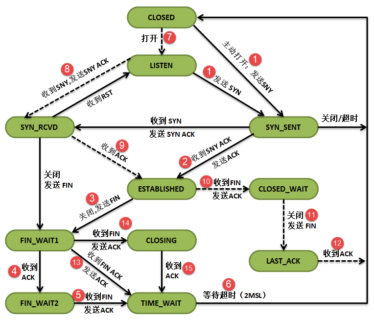

**三次握手**过程：

1. 图中 (7)：服务器的应用程序主动使服务器进入监听状态，等待客户端的连接请求。
2. 图中 (1)：首先客户端的应用程序会主动发起连接，发送 SNY 报文段给服务器，在发送之后就进入 SYN_SENT 状态等待服务器的 SNY ACK 报文段进行确认，如果在指定超时时间内服务器不进行应答确认，那么客户端将关闭连接。
3. 图中 (8)：处于监听状态的服务器收到客户端的连接请求（SNY 报文段），那么服务器就返回一个 SNY ACK 报文段应答客户端的响应，并且服务器进入 SYN_RCVD 状态。
4. 图中 (1)：如果客户端收到了服务器的 SNY ACK 报文段，那么就进入 ESTABLISHED 稳定连接状态，并向服务器发送一个 ACK 报文段。
5. 图中(9)：同时，服务器收到来自客户端的 ACK 报文段，表示连接成功，进入 ESTABLISHED 稳定连接状态，这正是我们建立连接的三次握手过程。

**四次挥手**过程：

1. 图中 (3)：一般来说，都是客户端主动发送一个 FIN 报文段来终止连接，此时客户端从 ESTABLISHED 稳定连接状态转移为 FIN_WAIT_1 状态，并且等待来自服务器的应答确认。
2. 图中 (10)：服务器收到 FIN 报文段，知道客户端请求终止连接，那么将返回一个 ACK 报文段到客户端确认终止连接，并且服务器状态由稳定状态转移为 CLOSE_WAIT 等待终止连接状态。
3. 图中 (4)：客户端收到确认报文段后，进入 FIN_WAIT_2 状态，等待来自服务器的主动请求终止连接，此时 {客户端-> 服务器} 方向上的连接已经断开。
4. 图中 (11)：一般来说，当客户端终止了连接之后，服务器也会终止 {服务器-> 客户端} 方向上的连接，因此服务器的原因程序会主动关闭该方向上的连接，发送一个 FIN 报文段给客户端。
5. 图中 (5)：处于 FIN_WAIT_2 的客户端收到 FIN 报文段后，发送一个 ACK 报文段给服务器。
6. 图中 (12)：服务器收到 ACK 报文段，就直接关闭，此时 {服务器-> 客户端} 方向上的连接已经终止，进入 CLOSED 状态。
7. 图中 (6)：客户端还会等待 2MSL，以防 ACK 报文段没被服务器收到，这就是四次挥手的全部过程。

> [!note]
>
> (13)(14)(15) 的这些状态都是一些比较特殊的状态，暂时就不讲解了，总的来说都是一样的。

## Qt / LVGL

## 传感器

### IMU

### GPS

## 深度学习


